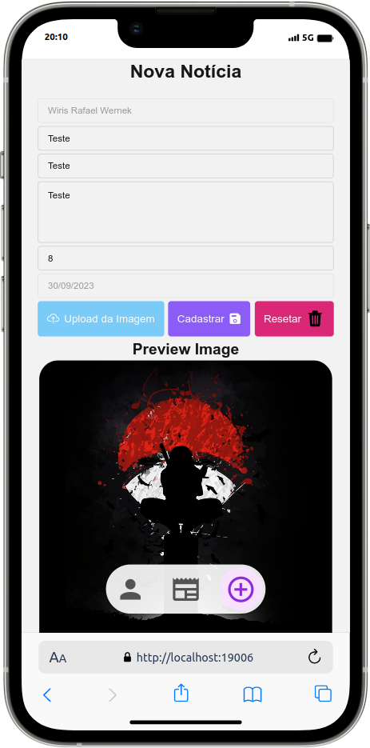

# Projeto The News

É um projeto multiplataforma desenvolvido com react native com objetivo de ser uma aplicação para publicação e avaliação de notícias.

## Tecnologias utilizadas:

- React Native
- Typescript
- Firebase Realtime Database
- Firebase Store
- Firebase Authenticator
- Biblioteca de componentes Native Base

## Como Instalar?

Para instalar siga os passo abaixo.

- Clone este projeto
- Entre na pasta dele
- Utilize o comando `npm i` ou `npm install` para instalar as dependências
- Utilize o comando `npm run web` para iniciar a aplicação no modo Web
- Ele abrirá automaticamente em seu navegador basta utilizar

## Algumas imagens da aplicação

	<h2>Pefil</h2>
	
	<h2 style="margin-top: 4rem;" >Lista de Notícias</h2>
	
	<h2 style="margin-top: 4rem;">Cadastro de Notícia</h2>
	

